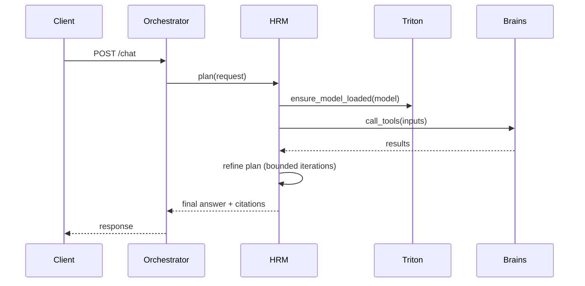

# HRM Core — Central Decision-Maker

The HRM (Human Resource Manager) governs planning and tool/brain selection. It runs as the Intelligence Service inside the Four-Brain architecture.

## Roles
- High-level Module (H-Module)
  - Always-loaded, small FP16 model
  - Responsibilities: goal decomposition, selecting brains (embedding, reranker, docling), setting constraints, and stopping criteria
- Low-level Module (L-Module)
  - On-demand, quantized (NVFP4 preferred)
  - Responsibilities: fast iteration, short-hop reasoning, tool invocation

## Control Loop


## Key Policies
- Iteration bounds: HRM_MAX_ITERATIONS (default 10)
- Convergence: HRM_CONVERGENCE_THRESHOLD (default 0.85)
- Safety: approval gates for risky actions; configurable per user
- Budgeting: VRAM and time budgets enforced via Orchestrator

## Interfaces
- plan(input): returns Plan + Tools
- step(state, tool_result): returns next action or stop
- summarize(state): returns final answer + rationale

## Example Pydantic Schemas
```python
from pydantic import BaseModel, Field
from typing import List, Optional

class ToolCall(BaseModel):
    name: str
    args: dict

class PlanStep(BaseModel):
    description: str
    tools: List[ToolCall] = []

class Plan(BaseModel):
    goal: str
    steps: List[PlanStep]
    max_iters: int = 10
    convergence: float = 0.85

class StepResult(BaseModel):
    next_step: Optional[PlanStep]
    done: bool
    notes: Optional[str] = None
```

## HRM Decision Heuristics
- Retrieval-first: if knowledge is required → embedding + rerank
- Document-first: if PDFs/Images present → Docling extract → embed chunks
- Personalization: bias retrieval with user profile vectors
- Efficiency: reuse cached embeddings; unload idle models

## Observability
- Emit per-iteration metrics: chosen tools, latency, GPU memory
- Log reasoning summaries (redacted) for review

## Configuration (docker-compose excerpts)
- HRM service environment (see containers/four-brain/docker-compose.yml):
  - HRM_ENABLED=true
  - HRM_MAX_ITERATIONS=10
  - HRM_CONVERGENCE_THRESHOLD=0.85
  - HRM_METRICS_ENABLED=true

## Testing HRM
- Unit-test decision functions with mocked brain responses
- Integration-test with Triton mock or small engines

## Extensions
- Add calendar/email/file-system tool adapters behind approval gates
- Add learning loop: capture failures → fine-tune L-Module

